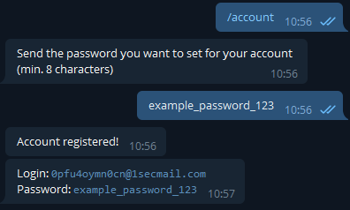

# MegaAccountCreatorBot

Telegram bot to create mega.nz accounts.

Demo: https://t.me/megaaccount_bot

<b>Enviroment variables you need to set:</b>

`API_ID`: Go to [my.telegram.org](https://my.telegram.org) to obtain this.

`API_HASH`: Go to [my.telegram.org](https://my.telegram.org) to obtain this.

`BOT_TOKEN`: Get the bot token from [BotFather](https://telegram.dog/botfather)

<b>How to use:</b>

Send `/account` command and then send a password you want to set on your mega.nz account. You will got your account in 10-30 seconds.

<b>Screenshot</b>

